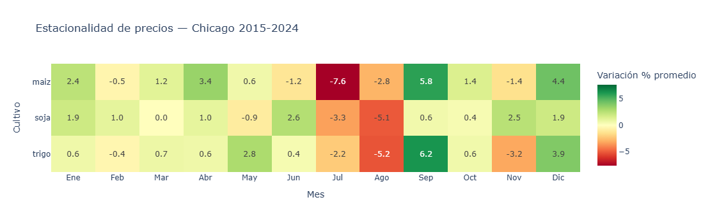

# Argentine Agricultural Commodities: Price & Production Analysis

Business-driven analysis of soybean, corn, and wheat markets (2015–2024), 
connecting Chicago futures prices (CME) with Argentine national production 
data to answer real commercial and risk-management questions.

## Business questions

1. **Seasonality** — When do prices historically rise or fall, month by month?
2. **Correlation** — How closely do soybean, corn, and wheat prices move together?
3. **Production vs. international price** — Does Argentine output actually move 
   the Chicago price, or is Argentina a price taker?
4. **Volatility** — Which years carried the highest price risk, and why?
5. **Hedging simulation** — Would futures hedging have protected a producer 
   in the 2022 drought campaign?

## Key findings

Prices fall systematically in July–August (up to -7.6% in corn) and rebound 
in September (+5.8% to +6.2%), aligned with the Northern Hemisphere yield 
definition and harvest calendar.

Correlation between crops is moderate (0.34–0.54). Corn-soybean and corn-wheat 
move more closely together (0.54) than soybean-wheat (0.34), consistent with 
shared planting seasons in Argentina.

Argentine yield correlates strongly with the Chicago price (-0.65 to -0.83), 
but total production much less so (-0.08 to -0.64) — evidence that yield 
captures a shared regional/global climate factor rather than Argentina alone 
driving world prices.

Wheat hit its historical volatility peak in 2022 (52% annualized) amid the 
Russia-Ukraine war; corn peaked in 2021 (36%) alongside exceptional Chinese demand.

Hedging soybeans in January 2022 would have given up a 25.2% price increase 
by harvest — a reminder that hedging value lies in the certainty it provides 
at decision time, not in predicting price direction.

*(Full detail, statistics, and business conclusions in the notebook)*

## Applied background

This project connects coursework and certifications into a single applied case:

- **BCR Stage 1** (Grain commercialization) — campaign structure, yield, planted/harvested area
- **BCR Stage 2** (Futures & options) — hedging simulation (Question 5)
- **Statistics & Probability, UNAM** — Pearson correlation, standard deviation
- **Applied Business Statistics, Universidad Austral** — translating statistics into business conclusions
- **Data Analytics, Talento Tech** — project structure and executive storytelling

## Data sources

- **Chicago futures prices**: [yfinance](https://pypi.org/project/yfinance/) 
  (tickers ZS=F, ZC=F, ZW=F), daily close, 2015–2024
- **Argentine production**: [datos.magyp.gob.ar](https://datos.magyp.gob.ar/dataset) 
  — national annual series, planted/harvested area, production, yield

## Tech stack

Python · Pandas · NumPy · Matplotlib · Seaborn · Plotly · yfinance · Google Colab

## Pipeline

ETL pipeline: extraction from two sources (financial API + public government 
data) → structural cleaning and feature engineering → branched transformation, 
where each business question applies a specific transformation (monthly 
aggregation, wide-format pivot, cross-source merge, annualized volatility, 
or campaign window) to a common clean dataset.

## Scope and limitations

- Prices reflect the international reference market (CME Chicago), not local 
  Argentine cash prices, due to lack of an equivalent open public source.
- Correlations measure linear relationships (Pearson) and do not imply causality.
- Question 3 uses 10 annual observations — a small sample for strong statistical claims.
- The hedging simulation (Question 5) is simplified: daily close price, single 
  campaign, no contract expiration, margin calls, or partial hedging.
- Scope limited to national-level data for three crops; excludes provincial/
  departmental breakdown and livestock markets.

## How to run

1. Open `ProyectoEtapaUnoBCR.ipynb` in Google Colab
2. Run all cells (`Runtime` → `Run all`)
3. Mount your own Google Drive when prompted, and adjust the file paths 
   in the MAGyP data-loading cell to your own folder structure

## Repository structure
- `ProyectoEtapaUnoBCR.ipynb` — main notebook
- `images/` — exported charts (seasonality, correlation, volatility)
- `README.md`
  
## Author

Roberto Pereira — Data Analytics transitioning into Analytics Engineering / 
Supply Chain Analytics, with a focus on agroindustrial and logistics decision-making. 
[LinkedIn](https://www.linkedin.com/in/roberto-jos%C3%A9-pereira-ochoa-4553982b7) · [GitHub](https://github.com/rjpereiradata)
